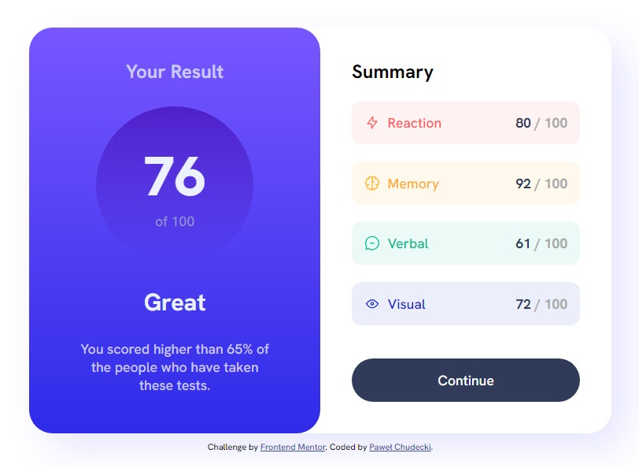

# Frontend Mentor - Results summary component solution

This is a solution to the [Results summary component challenge on Frontend Mentor](https://www.frontendmentor.io/challenges/results-summary-component-CE_K6s0maV). Frontend Mentor challenges help you improve your coding skills by building realistic projects.

## Table of contents

- [The challenge](#the-challenge)
- [Screenshot](#screenshot)
- [Links](#links)
- [Built with](#built-with)
- [What I learned](#what-i-learned)
- [Author](#author)

### The challenge

Users should be able to:

- View the optimal layout for the interface depending on their device's screen size
- See hover and focus states for all interactive elements on the page
- 
### Screenshot

### Links

- Solution URL: [https://www.frontendmentor.io/solutions/results-summary-component-t9ZiHQy2L\_](https://www.frontendmentor.io/solutions/results-summary-component-t9ZiHQy2L_)
- Live Site URL: [https://soulrvr29.github.io/results-summary-component/](https://soulrvr29.github.io/results-summary-component/)

### Built with

- Visual Studio Code
- Semantic HTML5 markup
- CSS custom properties
- Flexbox

### What I learned

I used rem units instead of pixels for font size, width, padding, and make the layout responsive.

## Author

- Frontend Mentor - [@SoulRvr29](https://www.frontendmentor.io/profile/SoulRvr29)
